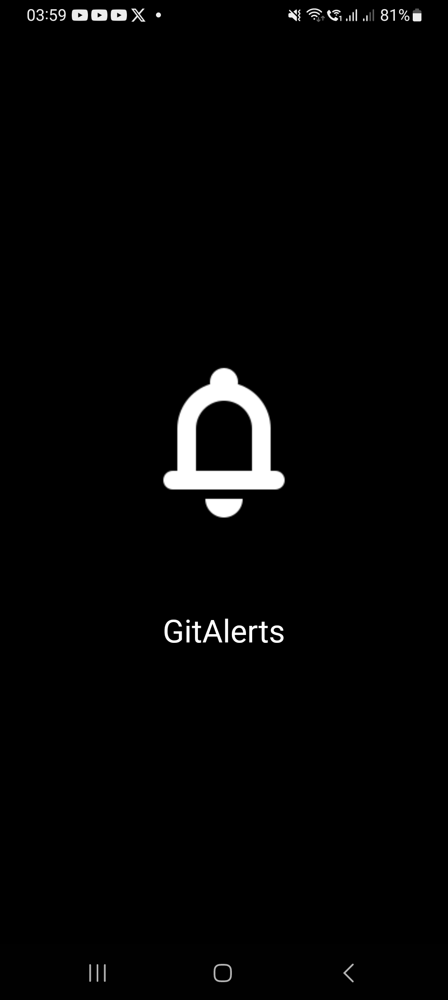
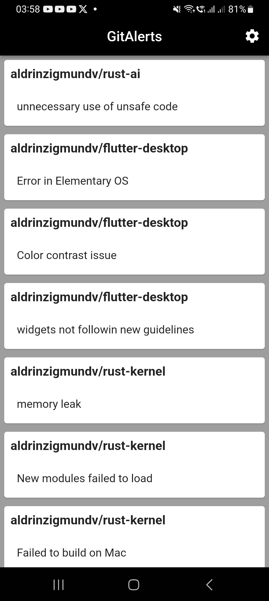
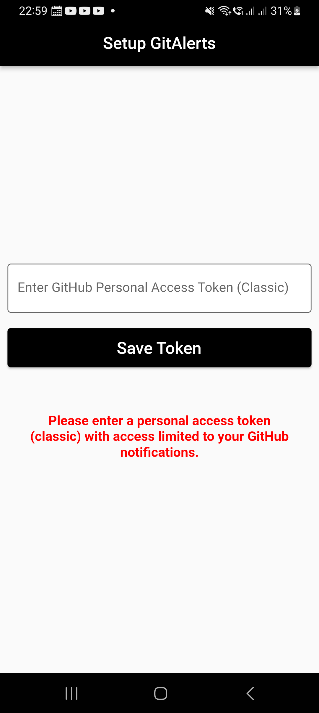
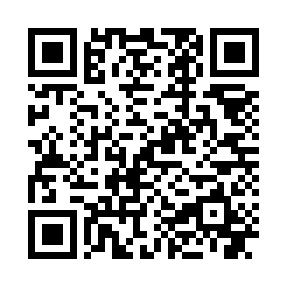

# GitAlerts

Or download the latest ad-free APK version from the [Releases Section](https://github.com/aldrinzigmundv/gitalerts/releases/latest)

## What is GitAlerts?

A free and open-source, privacy-focused GitHub notifications app.

GitAlerts provides users the convenience of receiving GitHub notifications right on their mobile devices using only a notification access token. This adds a crucial layer of security by avoiding the need to enter their GitHub passwords, thereby protecting their GitHub repositories from potential risks posed by other apps on their phones.

## Features
* Free and open-source, no tracking and ads
* Intuitive and easy-to-navigate interface design
* Customizable notification frequency

## Donate XMR or BTC to Support in Maintaining this App

Donate XMR to Support this App

86cQoPfKTJ2bRfGH5Ts2kzaXCRcVRiX8CUHKc9xmeUmQ8YM8Uzk9S97T5gQaqYu58C9wuFK7opDH7cM9EJyR4V5LAq9RGv4

Donate BTC to Support this App

bc1qruus6vnxrww6pqac3hvg6vsepmqv8d66dwjm59